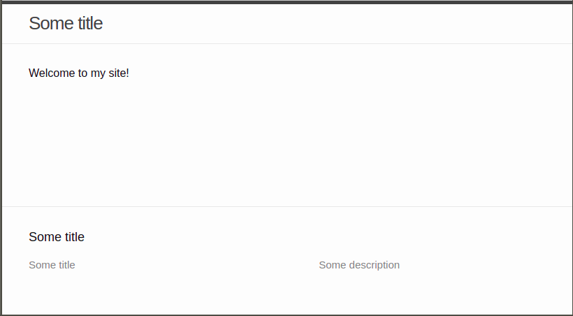

If measured by total lines of "code" (LOC), one would argue the simplest
webpage is the "Hello World" illustrated on [GitHub Pages landing
page](https://pages.github.com/): a `index.html` file containing only the
string "Hello World".

I prefer valid HTML and some CSS, therefore find below how I bootstrapped a
[Jekyll](https://jekyllrb.com/) powered website with two files and four lines
of text:

1. Create a YAML file named `_config.yml` with:
	```yaml
	title: Some title
	description: Some description
	theme: minima
	```
	(replace "title" and "description" values as you like.)

2. Create a Markdown file named `index.md` with:
	```markdown
	Welcome to my site!
	```

This will be the result once you push both files to a [properly named
repository](https://docs.github.com/en/pages/getting-started-with-github-pages/creating-a-github-pages-site)
and make sure [the "Minima" Jekyll theme is
enabled](https://docs.github.com/en/pages/getting-started-with-github-pages/adding-a-theme-to-your-github-pages-site-with-the-theme-chooser):



Enjoy!
